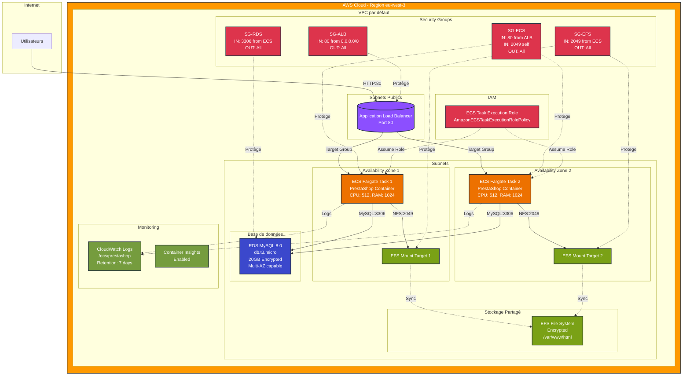

# PrestaShop sur AWS avec Terraform

Ce projet déploie automatiquement une infrastructure complète pour héberger PrestaShop sur AWS en utilisant Terraform avec une architecture modulaire.

## Table des matières

- [Architecture](#architecture)
- [Ressources AWS déployées](#ressources-aws-déployées)
- [Structure du projet](#structure-du-projet)
- [Prérequis](#prérequis)
- [Permissions IAM requises](#permissions-iam-requises)
- [Variables](#variables)
- [Outputs](#outputs)
- [Utilisation](#utilisation)
- [Modules](#modules)

## Architecture

L'infrastructure déploie PrestaShop sur AWS Fargate (ECS) avec les composants suivants :

- **Application Load Balancer (ALB)** : Distribue le trafic HTTP vers les conteneurs
- **ECS Fargate** : Exécute les conteneurs PrestaShop sans gestion de serveurs
- **RDS MySQL** : Base de données gérée pour PrestaShop
- **EFS** : Stockage partagé persistant pour les fichiers PrestaShop
- **VPC** : Réseau virtuel isolé (utilise le VPC par défaut)
- **Security Groups** : Contrôle du trafic réseau entre les composants

## Ressources AWS déployées

### Networking
- VPC par défaut AWS
- Subnets par défaut

### Security
- 4 Security Groups :
    - ALB Security Group (port 80 depuis Internet)
    - ECS Security Group (port 80 depuis ALB, port 2049 pour EFS)
    - RDS Security Group (port 3306 depuis ECS)
    - EFS Security Group (port 2049 depuis ECS)

### Load Balancing
- Application Load Balancer (ALB)
- Target Group (IP target type)
- HTTP Listener (port 80)

### Compute (ECS)
- ECS Cluster avec Container Insights activé
- ECS Task Definition (Fargate)
- ECS Service
- IAM Role pour l'exécution des tâches
- CloudWatch Log Group

### Storage
- EFS File System (chiffré)
- EFS Mount Targets (un par subnet)

### Database
- RDS MySQL 8.0
- DB Subnet Group
- Sauvegardes automatiques (rétention 7 jours)
- Stockage chiffré

## Structure du projet

```
.
├── main.tf                    # Configuration principale et appel des modules
├── variables.tf               # Variables globales
├── outputs.tf                 # Outputs globaux
└── modules/
    ├── networking/            # Gestion du VPC et des subnets
    │   ├── main.tf
    │   ├── variables.tf
    │   └── outputs.tf
    ├── security/              # Security Groups
    │   ├── main.tf
    │   ├── variables.tf
    │   └── outputs.tf
    ├── alb/                   # Application Load Balancer
    │   ├── main.tf
    │   ├── variables.tf
    │   └── outputs.tf
    ├── efs/                   # Elastic File System
    │   ├── main.tf
    │   ├── variables.tf
    │   └── outputs.tf
    ├── rds/                   # Base de données MySQL
    │   ├── main.tf
    │   ├── variables.tf
    │   └── outputs.tf
    └── ecs/                   # ECS Cluster, Service et Tasks
        ├── main.tf
        ├── variables.tf
        └── outputs.tf
```

## Prérequis

- [Terraform](https://www.terraform.io/downloads.html) >= 1.0
- [AWS CLI](https://aws.amazon.com/cli/) configuré avec vos credentials
- Un compte AWS avec les permissions appropriées (voir section suivante)
- Un mot de passe pour la base de données RDS

## Permissions IAM requises

L'utilisateur ou le rôle IAM utilisé pour déployer cette infrastructure doit avoir les permissions suivantes :

### EC2 / VPC
```json
{
  "Version": "2012-10-17",
  "Statement": [
    {
      "Effect": "Allow",
      "Action": [
        "ec2:DescribeVpcs",
        "ec2:DescribeSubnets",
        "ec2:DescribeSecurityGroups",
        "ec2:CreateSecurityGroup",
        "ec2:DeleteSecurityGroup",
        "ec2:AuthorizeSecurityGroupIngress",
        "ec2:AuthorizeSecurityGroupEgress",
        "ec2:RevokeSecurityGroupIngress",
        "ec2:RevokeSecurityGroupEgress",
        "ec2:CreateTags",
        "ec2:DeleteTags"
      ],
      "Resource": "*"
    }
  ]
}
```

### Elastic Load Balancing
```json
{
  "Version": "2012-10-17",
  "Statement": [
    {
      "Effect": "Allow",
      "Action": [
        "elasticloadbalancing:CreateLoadBalancer",
        "elasticloadbalancing:DeleteLoadBalancer",
        "elasticloadbalancing:DescribeLoadBalancers",
        "elasticloadbalancing:DescribeLoadBalancerAttributes",
        "elasticloadbalancing:ModifyLoadBalancerAttributes",
        "elasticloadbalancing:CreateTargetGroup",
        "elasticloadbalancing:DeleteTargetGroup",
        "elasticloadbalancing:DescribeTargetGroups",
        "elasticloadbalancing:DescribeTargetGroupAttributes",
        "elasticloadbalancing:ModifyTargetGroupAttributes",
        "elasticloadbalancing:CreateListener",
        "elasticloadbalancing:DeleteListener",
        "elasticloadbalancing:DescribeListeners",
        "elasticloadbalancing:AddTags",
        "elasticloadbalancing:RemoveTags"
      ],
      "Resource": "*"
    }
  ]
}
```

### ECS
```json
{
  "Version": "2012-10-17",
  "Statement": [
    {
      "Effect": "Allow",
      "Action": [
        "ecs:CreateCluster",
        "ecs:DeleteCluster",
        "ecs:DescribeClusters",
        "ecs:RegisterTaskDefinition",
        "ecs:DeregisterTaskDefinition",
        "ecs:DescribeTaskDefinition",
        "ecs:CreateService",
        "ecs:UpdateService",
        "ecs:DeleteService",
        "ecs:DescribeServices",
        "ecs:TagResource",
        "ecs:UntagResource"
      ],
      "Resource": "*"
    }
  ]
}
```

### RDS
```json
{
  "Version": "2012-10-17",
  "Statement": [
    {
      "Effect": "Allow",
      "Action": [
        "rds:CreateDBInstance",
        "rds:DeleteDBInstance",
        "rds:DescribeDBInstances",
        "rds:ModifyDBInstance",
        "rds:CreateDBSubnetGroup",
        "rds:DeleteDBSubnetGroup",
        "rds:DescribeDBSubnetGroups",
        "rds:AddTagsToResource",
        "rds:RemoveTagsFromResource",
        "rds:ListTagsForResource"
      ],
      "Resource": "*"
    }
  ]
}
```

### EFS
```json
{
  "Version": "2012-10-17",
  "Statement": [
    {
      "Effect": "Allow",
      "Action": [
        "elasticfilesystem:CreateFileSystem",
        "elasticfilesystem:DeleteFileSystem",
        "elasticfilesystem:DescribeFileSystems",
        "elasticfilesystem:CreateMountTarget",
        "elasticfilesystem:DeleteMountTarget",
        "elasticfilesystem:DescribeMountTargets",
        "elasticfilesystem:DescribeMountTargetSecurityGroups",
        "elasticfilesystem:TagResource",
        "elasticfilesystem:UntagResource"
      ],
      "Resource": "*"
    }
  ]
}
```

### IAM
```json
{
  "Version": "2012-10-17",
  "Statement": [
    {
      "Effect": "Allow",
      "Action": [
        "iam:CreateRole",
        "iam:DeleteRole",
        "iam:GetRole",
        "iam:PassRole",
        "iam:AttachRolePolicy",
        "iam:DetachRolePolicy",
        "iam:ListAttachedRolePolicies",
        "iam:TagRole",
        "iam:UntagRole"
      ],
      "Resource": "*"
    }
  ]
}
```

### CloudWatch Logs
```json
{
  "Version": "2012-10-17",
  "Statement": [
    {
      "Effect": "Allow",
      "Action": [
        "logs:CreateLogGroup",
        "logs:DeleteLogGroup",
        "logs:DescribeLogGroups",
        "logs:PutRetentionPolicy",
        "logs:TagLogGroup",
        "logs:UntagLogGroup"
      ],
      "Resource": "*"
    }
  ]
}
```

### Politique IAM complète recommandée

Vous pouvez utiliser cette politique IAM complète :

```json
{
  "Version": "2012-10-17",
  "Statement": [
    {
      "Effect": "Allow",
      "Action": [
        "ec2:*",
        "elasticloadbalancing:*",
        "ecs:*",
        "rds:*",
        "elasticfilesystem:*",
        "iam:CreateRole",
        "iam:DeleteRole",
        "iam:GetRole",
        "iam:PassRole",
        "iam:AttachRolePolicy",
        "iam:DetachRolePolicy",
        "iam:ListAttachedRolePolicies",
        "iam:TagRole",
        "iam:UntagRole",
        "logs:*"
      ],
      "Resource": "*"
    }
  ]
}
```

## Variables

### Variables obligatoires

| Variable      | Description                        | Type     | Exemple               |
|---------------|------------------------------------|----------|-----------------------|
| `db_password` | Mot de passe de la base de données | `string` | `"MonMotDePasse123!"` |

### Variables optionnelles

| Variable               | Description                             | Type     | Valeur par défaut                |
|------------------------|-----------------------------------------|----------|----------------------------------|
| `aws_region`           | Région AWS                              | `string` | `"eu-west-3"`                    |
| `project_name`         | Nom du projet                           | `string` | `"prestashop"`                   |
| `environment`          | Environnement (dev, staging, prod)      | `string` | `"dev"`                          |
| `db_instance_class`    | Classe d'instance RDS                   | `string` | `"db.t3.micro"`                  |
| `db_allocated_storage` | Stockage alloué pour RDS (GB)           | `number` | `20`                             |
| `db_engine_version`    | Version MySQL                           | `string` | `"8.0"`                          |
| `db_username`          | Nom d'utilisateur de la base de données | `string` | `"prestashop_user"`              |
| `db_name`              | Nom de la base de données               | `string` | `"prestashop"`                   |
| `ecs_cpu`              | CPU pour la tâche ECS                   | `string` | `"512"`                          |
| `ecs_memory`           | Mémoire pour la tâche ECS               | `string` | `"1024"`                         |
| `desired_count`        | Nombre d'instances désirées             | `number` | `2`                              |
| `prestashop_image`     | Image Docker PrestaShop                 | `string` | `"prestashop/prestashop:latest"` |
| `log_retention_days`   | Rétention des logs en jours             | `number` | `7`                              |

### Exemple de fichier terraform.tfvars

```hcl
aws_region     = "eu-west-3"
project_name   = "prestashop"
environment    = "production"
db_password    = "VotreMotDePasseSecurise123!"
desired_count  = 2
```

## Outputs

Après le déploiement, Terraform affiche les informations suivantes :

| Output               | Description                            | Sensible |
|----------------------|----------------------------------------|----------|
| `load_balancer_dns`  | DNS name du load balancer              | Non      |
| `load_balancer_url`  | URL complète pour accéder à PrestaShop | Non      |
| `database_endpoint`  | Endpoint de l'instance RDS             | Oui      |
| `database_port`      | Port de l'instance RDS                 | Non      |
| `efs_file_system_id` | ID du système de fichiers EFS          | Non      |
| `ecs_cluster_name`   | Nom du cluster ECS                     | Non      |
| `ecs_service_name`   | Nom du service ECS                     | Non      |

Pour afficher un output sensible :
```bash
terraform output database_endpoint
```

## Utilisation

### 1. Cloner le projet

```bash
git clone <votre-repo>
cd <votre-repo>
```

### 2. Créer un fichier terraform.tfvars

```bash
cat > terraform.tfvars <<EOF
aws_region  = "eu-west-3"
db_password = "VotreMotDePasseSecurise123!"
environment = "production"
EOF
```

### 3. Initialiser Terraform

```bash
terraform init
```

### 4. Vérifier le plan

```bash
terraform plan
```

### 5. Déployer l'infrastructure

```bash
terraform apply
```

Tapez `yes` pour confirmer le déploiement.

### 6. Accéder à PrestaShop

Une fois le déploiement terminé, récupérez l'URL :

```bash
terraform output load_balancer_url
```

Exemple de sortie :
```
http://prestashop-alb-123456789.eu-west-3.elb.amazonaws.com
```

Ouvrez cette URL dans votre navigateur pour accéder à PrestaShop.

> [!NOTE]
> Le premier démarrage peut prendre 5-10 minutes pour que PrestaShop s'installe complètement.

### 7. Détruire l'infrastructure

```bash
terraform destroy
```

## Modules

### Module Networking
- Récupère le VPC par défaut AWS
- Récupère les subnets disponibles

### Module Security
- Crée 4 Security Groups pour ALB, ECS, RDS et EFS
- Configure les règles d'ingress/egress appropriées

### Module ALB
- Crée l'Application Load Balancer
- Configure le Target Group
- Configure le Listener HTTP sur le port 80

### Module EFS
- Crée le système de fichiers EFS chiffré
- Crée les mount targets dans chaque subnet

### Module RDS
- Crée le DB Subnet Group
- Crée l'instance RDS MySQL 8.0 chiffrée
- Configure les sauvegardes automatiques

### Module ECS
- Crée le cluster ECS
- Crée la task definition Fargate
- Crée le service ECS avec intégration ALB
- Configure les rôles IAM
- Configure CloudWatch Logs

## Schéma d'architecture



## Sécurité

- Tous les Security Groups suivent le principe du moindre privilège
- Le stockage RDS et EFS est chiffré
- Les credentials de base de données sont marqués comme sensibles
- Les instances RDS ne sont pas accessibles publiquement
- Le transit EFS est chiffré (TLS)

## Coûts estimés

Les coûts varient selon la région et l'utilisation. Voici une estimation mensuelle pour la configuration par défaut :

- **ECS Fargate** (2 tâches) : ~50-60 USD
- **ALB** : ~20-25 USD
- **RDS db.t3.micro** : ~15-20 USD
- **EFS** : ~0.30 USD/GB stocké + coûts d'accès
- **Transfert de données** : Variable

> [!NOTE]
> Total estimé : ~90-110 USD/mois (hors stockage EFS et transfert de données)

> [!IMPORTANT]
> N'oubliez pas de détruire l'infrastructure avec `terraform destroy` si vous ne l'utilisez plus pour éviter des frais inutiles.

